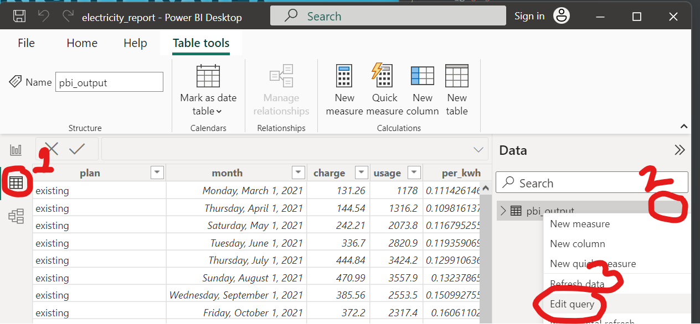
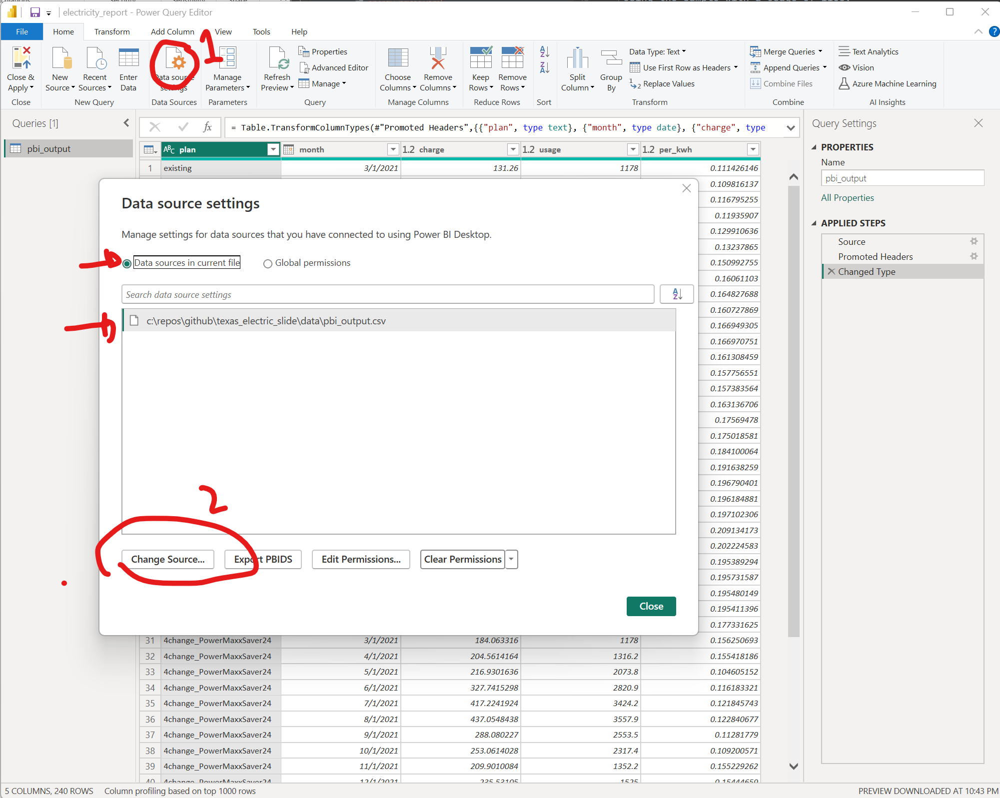

# Electric Slide

## Summary
This program will calculate your total Texas electric bill to evaluate several ERCOT providers when given multiple months of your actual usage data. I whipped it up and use it periodically. We make no claims to the accuracy of the calculations, but ya know it worked on my machine. 

## Requirements
Python 3.6 or higher, I last ran it on 3.10. I have not tested it on lower versions.

## Data
I have included my own data so try not to laugh to hard at my bills. I use a lot of power. 

### Energy_Prices.Yaml
This file contains the details of the various plans and should be updated or adjusted based on the plans you are evaluating. I also have no idea how the plans vary by location, since I didn't do that evaluation. A sample of the format is below. This files in the data folder are the actual values for a few plans at the time of my last run. I tired to include the Fact Sheets where I could. 

I use the "yearlyUsageData_unittest.csv" for creating and updating the prices as sites like **comparepower.com** show 500kwh, 1000kwh, and 2000kwh usage by default. I then run the script after I add each new power plan to the yaml file to make sure I get the correct answers in the pbi_output.csv file. I have included two other usages which correspond to my average and max usage which I then type in to the custom usage to get the custom cost back. I might document this in the future, but I am not sure how useful it is.

#### Sample Plan
```yaml
- provider: Express
  name: Freeway12
  link: https://www.myexpressenergy.com/viewpdf.aspx/?Docs/efl_frwyva12iae_c.pdf
  charges:
    - name: charge_kwh_0_1000
      from_kwh: 0
      to_kwh: 1000
      type: per_kwh
      cost: 11.95
      cost_unit: cents
    - name: charge_kwh_1000_2000
      from_kwh: 1000
      to_kwh: 2000
      type: per_kwh
      cost: 0
      cost_unit: cents
    - from_kwh: 2000
      to_kwh: 9999
      type: per_kwh
      cost: 11.95
      cost_unit: cents
    - name: monthly_access_charge
      from_kwh: 0
      to_kwh: 1000
      type: monthly
      cost: 9.95
      cost_unit: dollars
```

#### Example calculation based on sample plan
The calculation is made based on the energy usage inputted to the function *determine_plan_cost*. Monthly costs are calculated if the range is met at all and per_kwh costs are how much of the range is met. 

Using the sample with a usage of 1100:

* **charge_kwh_0_1000** would calculate the cost of 11.95 cents per kwh for 1000kwh or $119.50

* **charge_kwh_1000_2000** would calculate the cost of 0 cents per kwh for 100kwh (1100-1000) or $0

* the noname charge(names are optional) would calculate the cost of 11.95 cents per kwh for 0kwh or $0

* **monthly_access_charge** would calculate $9.95

For a total of $129.45


### yearlyUsageData.csv

This is the format for the data to be input for your homes actual usage. It is pretty much the exact export that Reliant gave to me with the addition of a year column. I have included a sample of the format below. 

```csv
YEAR SUMMARY,,,,,
YEAR_TOTAL_USAGE (kWh),19809.3,,,,
YEAR_AVG_TEMP_HI (F),78,,,,
YEAR_AVG_TEMP_LO (F),69,,,,
YEAR,MONTH,MONTH_USAGE (kWh),MONTH_COST ($),MONTH_AVG_TEMP_HI,MONTH_AVG_TEMP_LO (F)
2021,Mar,1178,131.26,71,60
2021,Apr,1316.2,144.54,75,66
2021,May,2073.8,242.21,80,73
2021,Jun,2820.9,336.7,87,79
2021,Jul,3424.2,444.84,87,80
2021,Aug,3557.9,470.99,89,81
2021,Sep,2553.5,385.56,85,75
2021,Oct,2317.4,372.2,79,71
2021,Nov,1352.2,222.88,67,59
2021,Dec,1525,245.11,71,65
2022,Jan,1108.6,185.08,59,49
```


## Power BI Setup

### Reconfigure the Power BI report to use the new file
If you choose not to clone the repo to *C:\repos\github\texas_electric_slide* like I do, you will need to update the Power BI report to point to the new file. I am sure there is a way to do this dynamically, but I have not figured that out.

Step 1. Edit the query


Step 2. Change the path to your pbi_output.csv file


